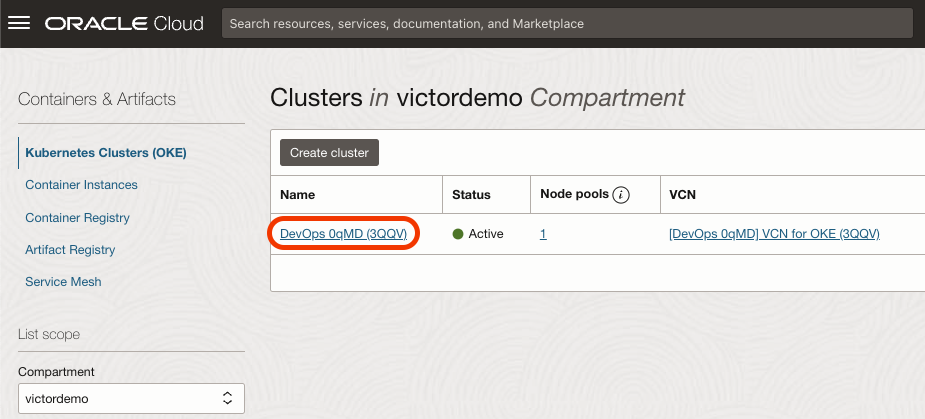
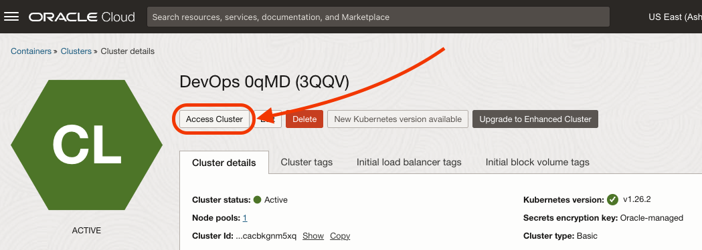
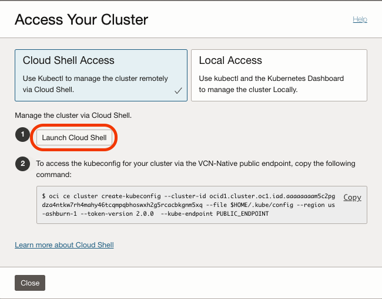
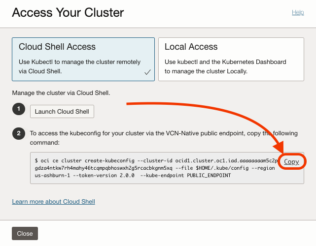
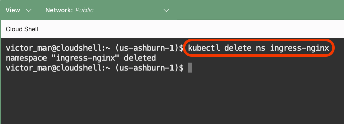
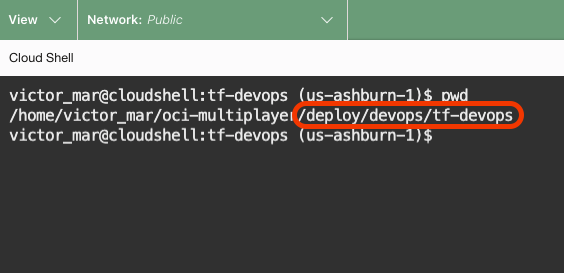
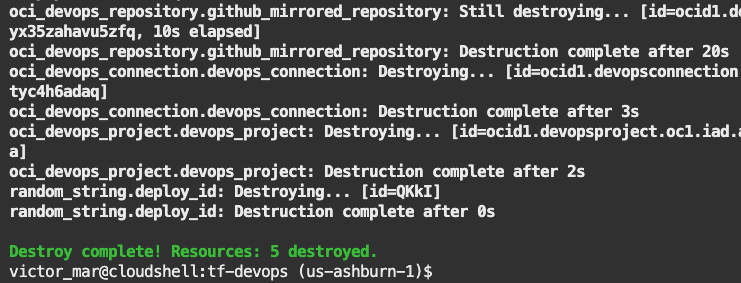
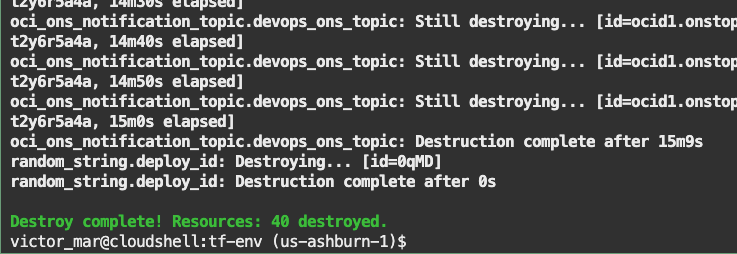

# Clean Up (Optional)

## Introduction

It is always a good practice to clean up after you learned about OCI DevOps. With Terraform and Kubernetes the process is very simple.

Estimated Lab Time: 10 minutes

### Objectives

In this optional lab, you are going to clean the resources created during the workshop.

### Prerequisites

* An Oracle Free Tier, Paid or LiveLabs Cloud Account
* Active Oracle Cloud Account with available credits to use for Data Science service.

## Task 1: Delete Load Balancer from Kubernetes

1. Go to **Menu** > **Developer Services** > **Kubernetes Clusters (OKE)**

  

2. The Kubernetes Cluster will be on the list, the name starting with `DevOps`. Click on the Kubernetes Cluster name.

  

3. At the top, click on **Access Cluster**.

  

4. If you have the Cloud Shell still open, jump to step 2. If not, click on **Launch Cloud Shell**.

  

5. Copy the command from step 2. And paste it on the Cloud Shell. Run the command.

  

6. Paste it on Cloud Shell and run it.

  

7. Check it is configured. Run the following command and see the services.

    ```bash
    <copy>kubectl get pods</copy>
    ```

  

8. After that, delete the ingress controller, hence the load balancer.

    ```bash
    <copy>kubectl delete ns ingress-nginx</copy>
    ```

    > NOTE: This might take up to 2 minutes.

9. It will take a couple of minutes.

  

## Task 2: Delete infrastructure

1. From the Cloud Shell, make sure you are in `tf-devops` folder.

    ```bash
    <copy>pwd</copy>
    ```

2. It should look like this:

  

3. If you are not in `tf-devops` folder, change the current directory until you get there.

4. Run the following command to destroy the OCI DevOps infrastructure.

    ```bash
    <copy>terraform destroy -auto-approve</copy>
    ```


5. When the Terraform `destroy` finishes successfully.

  

6. Change the directory to the `tf-env`

    ```bash
    <copy>cd ../tf-env</copy>
    ```

7. Run the following command to destroy the rest of the infrastructure.

    ```bash
    <copy>terraform destroy -auto-approve</copy>
    ```

8. When the Terraform `destroy` finishes successfully, you have finished cleaning up.

  

## Acknowledgments

* **Author** - Victor Martin, Tech Product Strategy Director (EMEA)
* **Contributors** - Wojciech Pluta - DevRel, Eli Schilling - DevRel
* **Last Updated By/Date** - July 1st, 2023