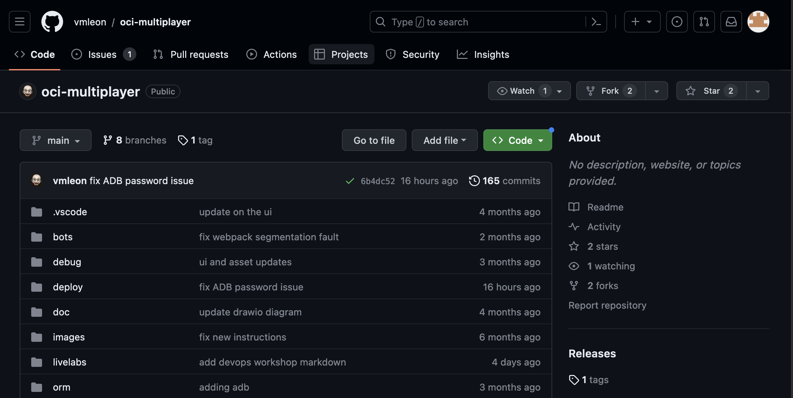
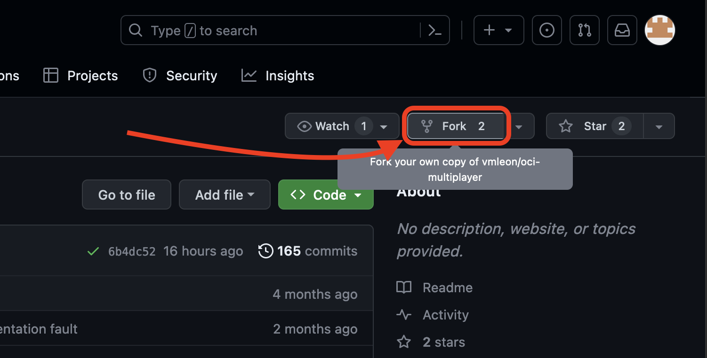
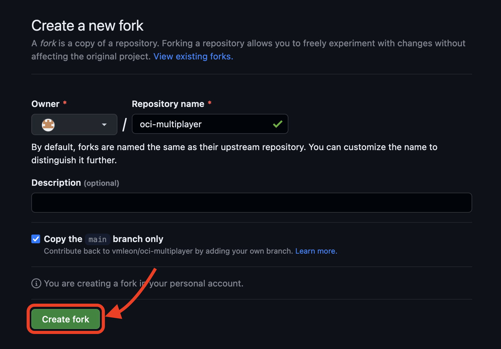
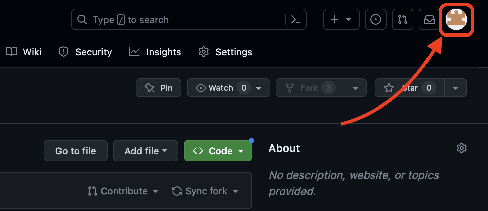
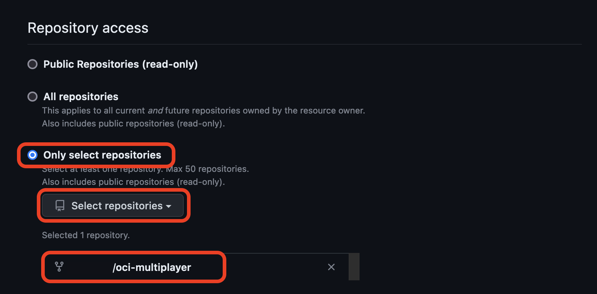
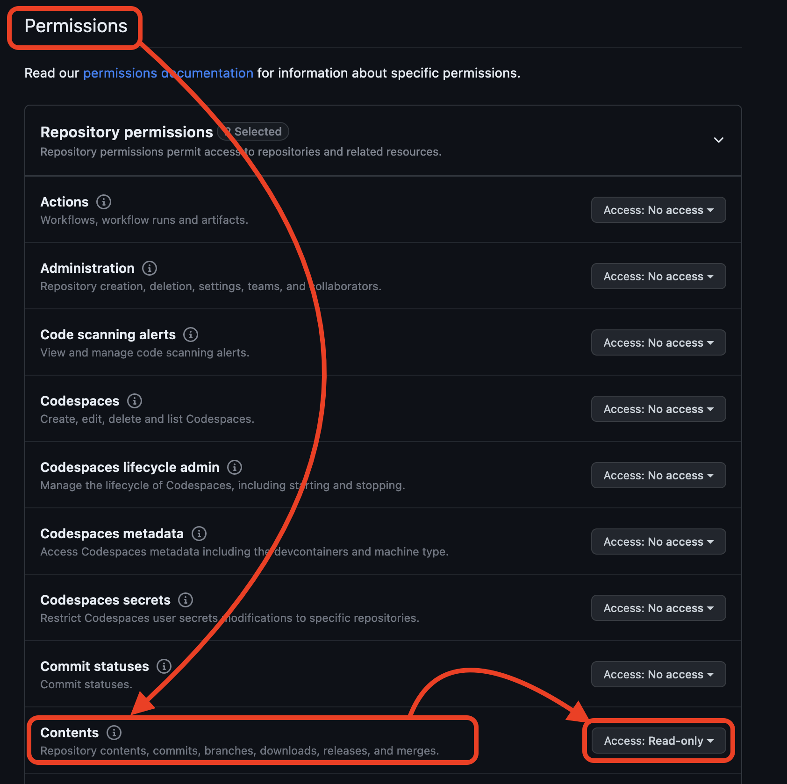
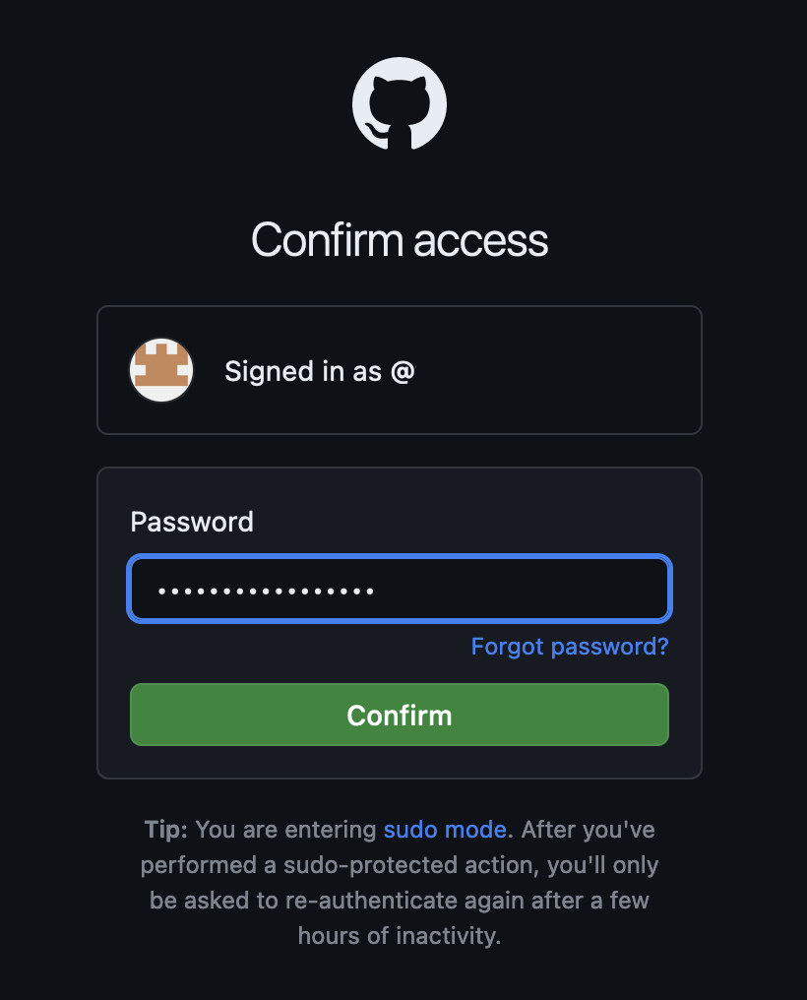
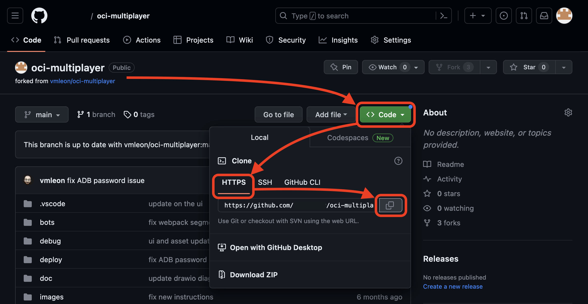

# GitHub Fork

## Introduction

The source code of the microservice application lives on GitHub. This is a more complex scenario, the easy way would be to have the code as well on OCI DevOps, but this extra integration can be interesting for those of you that still have the code on other source code control systems.

Estimated Lab Time: 15 minutes

### Objectives

During this lab, you are going to clone a GitHub repository to have your own copy. The rest of the workshop will be working based on your fork.

### Prerequisites

* An Oracle Free Tier, Paid or LiveLabs Cloud Account
* Active Oracle Cloud Account with available credits to use for Data Science service.

## Task 1: Fork repo

1. Open a new tab in your browser and go to the [OCI DevOps OKE](https://github.com/vmleon/oci-multiplayer) repository.
  
  

1. Click on **Fork**.
  
  

3. Leave the repo name and click **Create fork**, it takes just a few seconds.
  
  
  
  
4. When the fork process has finished take a look to the URL. Now the repo is under your GitHub user.
  
  
  

## Task 2: Create an access token

1. Go to your profile icon in GitHub.
  
  

2. Go to **Settings**.
  
  

1. Scroll to the end, and click **Developer settings**.
  
  

1. Expand **Personal access tokens** and click on **Fine-grained tokens**.
  
  

1. Click **Generate new token**.
  
  

1. Fill in the form: **Token name**, **Expiration**, **Description**, **Resource owner**
  
  

1. Check **Only select repositories**.
  
  

8.  On permissions, set **Contents** to **Read-only**. (to be confirmed that this is enough)
  
  

9.  Click **Generate token**.
  
  

1.  It will ask for your GitHub Account password to confirm.
  
  

1.  Copy the generated token in a safe place. You will need it later. Make sure to copy your personal access token now as you will not be able to see this again.
  
  

## Task 3: Clone the new repository

1. Clone the forked repository. Click Code and select HTTPS.
    
  

1. Log in on Oracle Cloud and open Cloud Shell.
  
  

1. Git Clone the repository. Type `git clone ` and then paste the URL copied from GitHub.

  

    ```bash
    <copy>git clone https://github.com/YOUR_USER_HANDLER/oci-multiplayer.git</copy>
    ```

1. Change the directory to the cloned repository:
    
    ```bash
    <copy>cd oci-multiplayer</copy>
    ```

You may now [proceed to the next lab](#next).

## Acknowledgements

* **Author** - Victor Martin, Tech Product Strategy Director (EMEA)
* **Contributors** - Wojciech Pluta - DevRel, Eli Schilling - DevRel
* **Last Updated By/Date** - July 1st, 2023