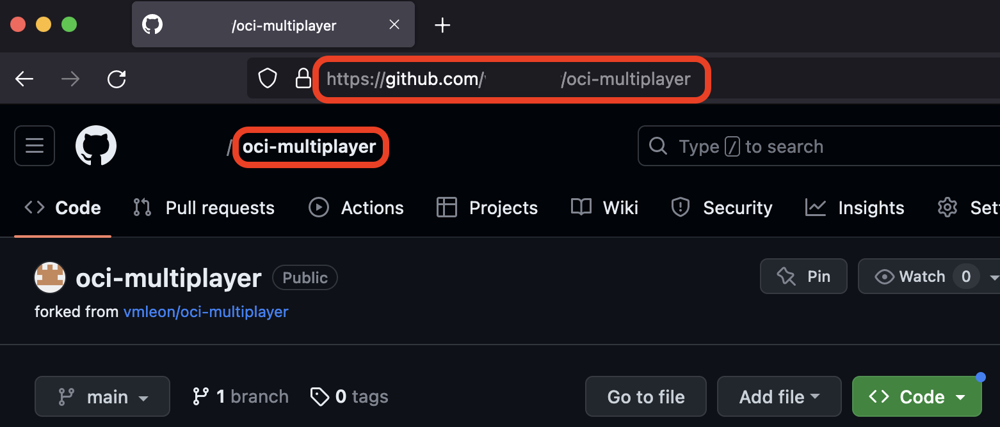
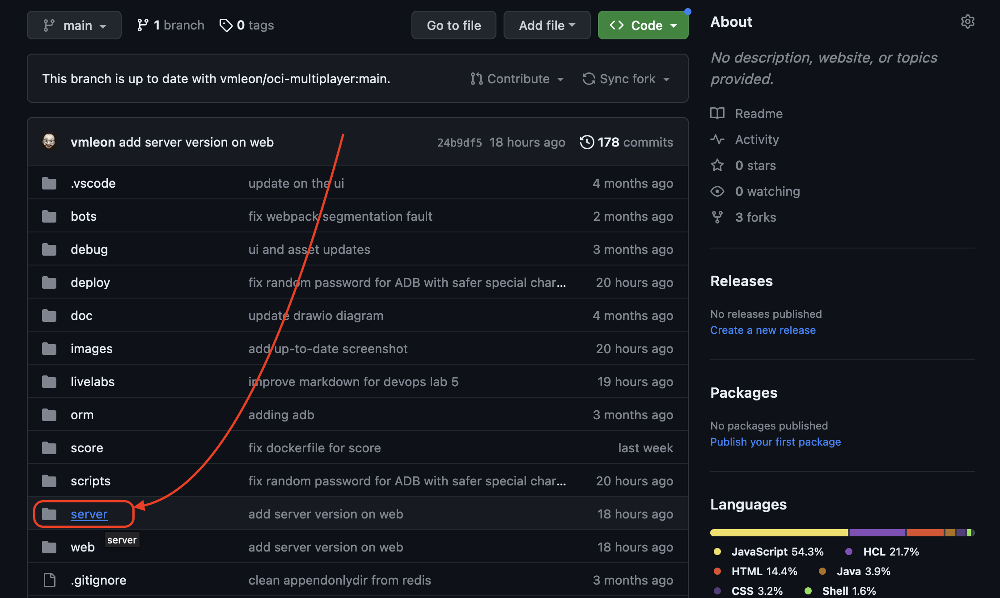
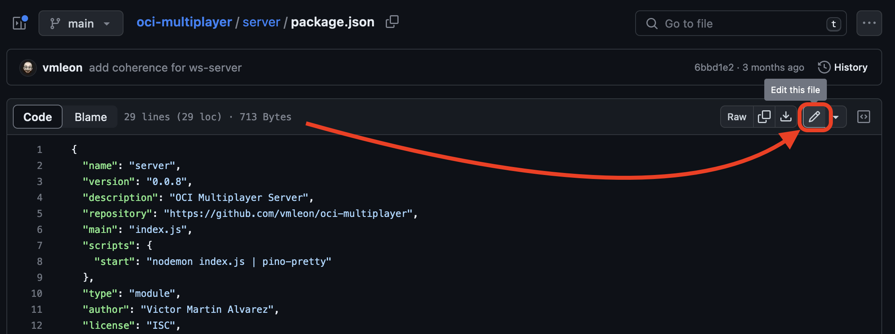

# Release New Feature

## Introduction

As part of a normal software development lifecycle, you will have to create new features and deploy those new features. OCI DevOps helps you to do that.

Estimated Lab Time: 15 minutes

### Objectives

In this lab, you are going to change the code to one of the components and release the application again. The release will be done by running the Build pipeline and Deployment pipeline.

### Prerequisites

* An Oracle Free Tier, Paid or LiveLabs Cloud Account
* Active Oracle Cloud Account with available credits to use for Data Science service.

## Task 1: Bump the version of a service

1. You are going to change the version of the server, representing the addition of one new feature. Go to your GitHub forked repository.

  

1. Click on the `server` folder on the code panel.

  

1. Click on the `package.json` file.

  

1. Click the **Edit this file** button.

  

2. Edit the `version` and click **Commit changes...** button.

  

## Task 2: Build and Deploy

1. Go to OCI DevOps Build Pipeline.

  

2. Click **Start manual run**

  

1. Click **Start manual run** to confirm on the parameters screen.

  

3. After a successful build execution of the pipeline

  

1. Go back to the DevOps project.

  

1. Go to the Deployment pipeline.

  

1. Click **Run Pipeline**.

  

1. Confirm the **Start manual run**.

  

5. Get the curl command and execute it.

  

6. The Server version would be the one you bumped.

  

## Task 3: Rollback (Optional)

1. From a terminal configured with GitHub run the revert of the last commit, just to simulate a rollback.

    ```bash
    <copy>git revert --no-edit main~1</copy>
    ```

  

2. Run the git push

    ```bash
    <copy>git push origin main</copy>
    ```

  

1. Go to OCI DevOps Build Pipeline.

  

2. Click **Start manual run**

  

1. Click **Start manual run** to confirm on the parameters screen.

  

3. After a successful build execution of the pipeline

  

1. Go back to the DevOps project.

  

1. Go to the Deployment pipeline.

  

1. Click **Run Pipeline**.

  

1. Confirm the **Start manual run**.

  

5. Get the curl command and execute it.

  

6. The Server version would be the one you rollbacked to.

  

You may now [proceed to the next lab](#next).

## Acknowledgments

* **Author** - Victor Martin, Tech Product Strategy Director (EMEA)
* **Contributors** - Wojciech Pluta - DevRel, Eli Schilling - DevRel
* **Last Updated By/Date** - July 1st, 2023